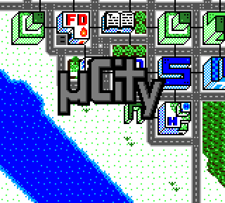
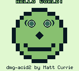

# gameboy

**A Game Boy and Game Boy Color emulator written from scratch in Rust. Runs Pokémon Red start to finish, with all four sound channels.**

[](https://github.com/x0cero/gameboy/actions/workflows/ci.yml)
[](LICENSE)


**[Play it in your browser](https://x0cero.github.io/gameboy/)**: the same core compiled to WebAssembly, with a homebrew game preloaded. Prebuilt binaries for macOS, Linux, and Windows are on the [Releases page](https://github.com/x0cero/gameboy/releases).

<p align="center">
  
</p>

<p align="center">
  
  
  
</p>

No emulation libraries and no ports of reference code: every component was built against the Pan Docs and hardware test ROMs, one failing opcode at a time.

## Features

| Area | What is implemented |
| --- | --- |
| CPU | Complete SM83 instruction set including the CB block, interrupt dispatch, HALT (and the halt bug), delayed EI |
| PPU | Background, window, sprites, the 10-sprites-per-line limit, full LCD state machine |
| Audio | All four APU channels (sweep, envelope, length counters), 44.1 kHz stereo output through cpal |
| Game Boy Color | VRAM and WRAM banking, palette RAM, VRAM DMA, double-speed mode |
| Cartridges | No mapper, MBC1, MBC3 (including the real-time clock), MBC5 |
| Persistence | Battery saves written to a `.sav` file next to the ROM |
| Quality of life | Save states, pause, fast-forward |

## Accuracy

- Passes Blargg's `cpu_instrs` test suite.
- Renders `dmg-acid2` correctly, which exercises sprite priority, window behavior, and background attribute edge cases.
- Pokémon Red is playable from the title screen through normal gameplay, saving and loading included.
- Commercial and homebrew Game Boy Color titles render in full color.

## Controls

| Key | Action |
| --- | --- |
| Arrow keys | D-pad |
| Z | A |
| X | B |
| Enter | Start |
| Right Shift | Select |
| P | Pause |
| Tab (hold) | Fast-forward |
| F5 | Save state |
| F7 | Load state |
| Esc | Quit |

## Build and run

Requires a stable Rust toolchain.

```sh
git clone https://github.com/x0cero/gameboy
cd gameboy
cargo run --release path/to/rom.gb
```

Headless frame dump, useful for testing and for capturing images:

```sh
GB_DUMP=600 ./target/release/gameboy path/to/rom.gb --headless
```

That runs 600 frames with no window, then writes the screen to `frame.ppm` and the captured audio to `samples.raw`.

### About ROMs

No ROMs are included here. To play a commercial game you need to dump the cartridge you own yourself, using your own hardware. The freely distributable homebrew and test ROMs used during development are [Blargg's test suite](https://github.com/retrio/gb-test-roms), [dmg-acid2](https://github.com/mattcurrie/dmg-acid2), [Libbet](https://github.com/pinobatch/libbet), and [µCity](https://github.com/AntonioND/ucity).

## Architecture

The emulator is a straightforward component tree: the CPU owns the bus, and the bus owns everything the CPU can address.

| File | Responsibility |
| --- | --- |
| `src/cpu.rs` | SM83 core: fetch, decode, execute, interrupts, timing |
| `src/bus.rs` | Memory map, timers (DIV/TIMA/TMA/TAC), IF/IE, DMA |
| `src/ppu.rs` | Pixel pipeline and LCD state machine |
| `src/apu.rs` | The four sound channels and the mixer |
| `src/cartridge.rs` | Header parsing, mapper banking, battery saves |
| `src/main.rs` | Window, input, audio output, save states, headless mode |

The main loop steps the CPU, hands the elapsed cycles to the bus (which advances the timers, the PPU, and the APU), and presents the framebuffer whenever the PPU signals a completed frame.

## Known gaps

These are deliberate trade-offs, written down rather than hidden:

- Cycle counting is per-instruction, not sub-instruction accurate, so Blargg's `mem_timing` fails. Games are unaffected in practice.
- OAM DMA and Game Boy Color VRAM DMA complete instantly instead of taking their real cycle counts.
- The OAM bug (a hardware quirk of the original DMG) is not emulated.
- Link cable and serial transfer are stubbed, so multiplayer and trading do not work.

## Part of a series

This is the first in a set of hand-written emulators, each one a step up in hardware complexity. The next is a Game Boy Advance emulator, also in Rust: [x0cero/gba](https://github.com/x0cero/gba).

## License

MIT, see [LICENSE](LICENSE).
