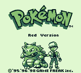

# gameboy

A Game Boy and Game Boy Color emulator written from scratch in Rust. No emulation libraries, no reference-code ports: every component was built against the Pan Docs and hardware test ROMs, one failing opcode at a time.

  

## What it does

- **Full SM83 CPU** — complete instruction set including the CB block, interrupt dispatch, HALT (and the halt bug), delayed EI. Passes Blargg's `cpu_instrs`.
- **PPU** — background, window, sprites, 10-sprites-per-line limit. Renders `dmg-acid2` correctly.
- **APU** — all four channels (sweep, envelope, length counters) with 44.1 kHz stereo output via cpal.
- **Game Boy Color mode** — VRAM/WRAM banking, palette RAM, VRAM DMA, double-speed mode.
- **Mappers** — none, MBC1, MBC3 (with RTC), MBC5, plus battery saves (`.sav` written next to the ROM).
- **Quality of life** — save states (F5/F7), pause (P), fast-forward (Tab).

Pokémon Red is fully playable. Commercial and homebrew GBC titles render in full color.

## Running

```sh
cargo run --release path/to/rom.gb
```

Controls: arrows for the D-pad, Z = A, X = B, Enter = Start, Right Shift = Select, Esc quits.

Headless frame dump (useful for testing): `GB_DUMP=N ./target/release/gameboy rom.gb --headless` renders N frames and writes `frame.ppm`.

No ROMs are included. Test ROMs used during development: [Blargg's test suite](https://github.com/retrio/gb-test-roms), [dmg-acid2](https://github.com/mattcurrie/dmg-acid2), and the homebrew games [Libbet](https://github.com/pinobatch/libbet) and [µCity](https://github.com/AntonioND/ucity).

## Architecture

- `src/cpu.rs` — SM83 core: fetch/decode/execute, interrupts, timing.
- `src/bus.rs` — memory map, timers (DIV/TIMA/TMA/TAC), IF/IE, DMA.
- `src/ppu.rs` — pixel pipeline and LCD state machine.
- `src/apu.rs` — the four sound channels and mixer.
- `src/cartridge.rs` — header parsing, mapper banking, battery saves.

## Known inaccuracies

Cycle counting is per-instruction, not sub-instruction accurate (`mem_timing` fails; games run fine). OAM DMA and GCB VRAM DMA complete instantly rather than over their real cycle counts. These are honest trade-offs, documented rather than hidden.

## License

MIT
